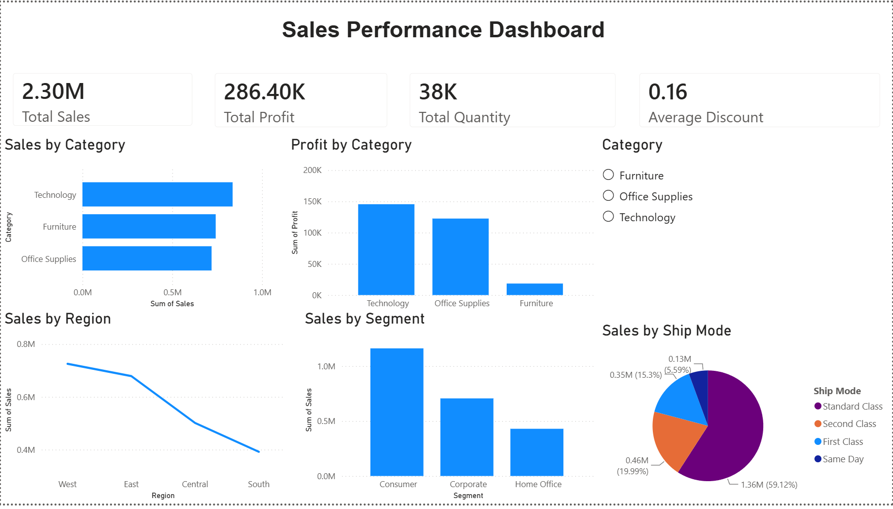
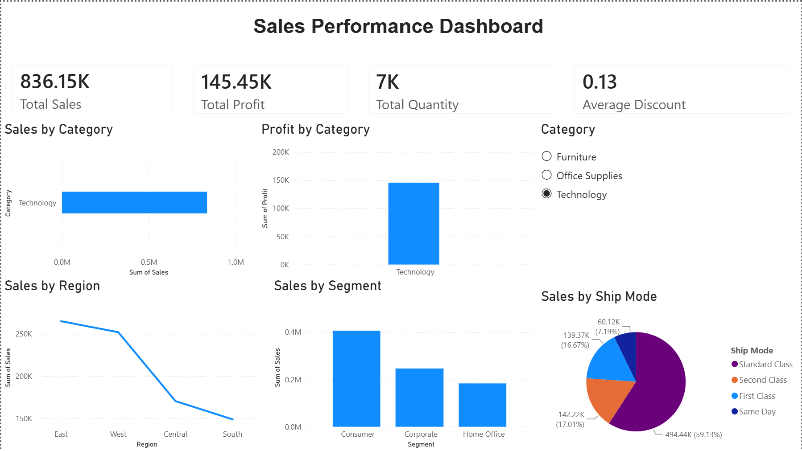

# Sales Performance Power BI Dashboard

Interactive Power BI sales performance dashboard analyzing sales, profitability, customer segments, regions, product categories, shipping modes, and key performance indicators.

## Project Overview

This project demonstrates practical business analytics and data visualization skills using Microsoft Power BI. The dashboard transforms sales data into an interactive visual report that allows users to explore business performance across multiple dimensions.

## Key Areas Analyzed

- Total Sales
- Total Profit
- Total Quantity
- Average Discount
- Sales by Category
- Profit by Category
- Sales by Region
- Sales by Customer Segment
- Sales by Ship Mode
- Interactive Category Filtering

## Tools & Skills

- Microsoft Power BI
- Data Visualization
- Business Analytics
- Dashboard Design
- Data Exploration
- KPI Analysis
- Interactive Filtering

## Dashboard Preview

### Full Dashboard

### Interactive Category Filter

The category slicer allows users to filter the dashboard and dynamically update the displayed KPIs and visualizations.

## Project Files

- `Sales_Performance_Dashboard.pbix` — Interactive Power BI dashboard
- `sales_data.csv` — Source dataset used for the analysis
- `dashboard-overview.png` — Full dashboard preview
- `dashboard-category-filter.png` — Example of interactive category filtering

## Key Insights

- Technology is a major contributor to overall sales and profitability.
- Sales performance varies across the four regions.
- Customer segments contribute differently to overall sales.
- Standard Class represents the largest share of sales among the shipping modes.
- Category filtering allows users to examine performance at a more detailed level.

## Purpose

This project was developed as part of my analytics portfolio to demonstrate practical experience with business intelligence, data visualization, KPI reporting, and interactive dashboard development.
